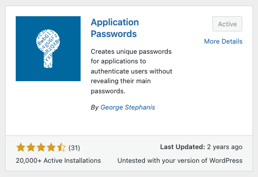

## Setup

### Step 1: Create conda environment and install requirements

```
conda create -n "autoblogger_wordpress"
conda activate autoblogger_wordpress
pip3 install -r requirements.txt
```

### Step 2: Create .env file and input your credentials

Copy the .env.example file into a file called .env in the root of the directory. Here are the fields to change:

1. **OPENROUTER_API_KEY:** Go to openrouter.ai and create api key. Insert it in the .env file.
2. **WP_MEDIA:** Change the base url in the WP_MEDIA line in the .env file to your website.
3. Go to add new plugin in wordpress. Search for "application passwords" and install the first app.
   
4. Create a new application in the application passwords app and input **WP_APPLICATION_USERNAME** and **WP_APPLICATION_PASSWORD** in the .env file.
5. **WP_CATEGORIES:** replace base url with your site.
6. **WP_TAGS:** replace base url with your site
7. **UNSPLASH_API_KEY:** Make an api key on unsplash.com and replace your api key in the .env file.
8. **SERPER_API_KEY:** Make an api key on serper.dev and replace your api key in the .env file.
9. **OPENAI_API_KEY:** Make an api key on openai.com and replace your api key in the .env file.
10. **WP_BASE:** Change to your base url.
11. **WP_POSTS:** Change to your posts url.

### Step 3: Create CSV with keywords list

Now you should create a CSV file in csvs/ with a list of your keywords the app will use. You can easily create a compatible CSV file by exporting a keywords list from ahrefs.com. Otherwise you can create a CSV by copying the probiotics.csv which is already in the directory. The CSV file should contain a column that is labeled Keyword (with capital K). No other columns are needed.

### Step 4: Starting the app

There are two arguments needed to start the app.

1. **keyword:** this is the name of your CSV file with a list of keywords you would like to create articles for. Since the CSV file given with the repo is called probiotics.csv, to run the keywords in the file you would call "--keyword "probiotics"
2. **category:** this is the wordpress category that will be used for the articles. If it is not already created in wordpress the category would be created. Example: --category "Health & Household"

Now run the app like this:

```
python3 gpt_keyword.py --keyword "probiotics" --category "Health & Household"
```

## How it works

1. The app will scrape the first page of organic google search results using serper.dev and playwright python.
2. The app will summarize each result using Chat GPT and combine the summaries.
3. The app will come up with a slug, tags, title and ~10 headings for the article based on the content of the article summaries.
4. The app will search the tags on unsplash and get the first image for the featured image in your article.
5. The app will make an intro paragraph based on the langchain RetrievalQA of the keyword based on the article summaries.
6. The app will fill out the article using the headings and RetrievalQA of the headings given the article summaries. This way everything will fit in the context window of the chat gpt turbo or chat gpt turbo 16k while also getting relevant information for each section.
7. Tags and category are dealt with using functions available in the app.
8. The app will log the keywords which are used in the csvs/finished/ folder with the keyword as the csv name. Example: probiotics.csv

## Updates

- **Aug 23 11:38pm EST - Fixed bug in section schemas to parse out extra heading**
- **Aug 23, 7:00pm EST -- Updated section schemas to parse out extra heading.**
- **Aug 23, 4:43am EST -- Just updated section schemas to add better parsing.**
- **Aug 23, 2:47an EST -- Just updated intro schemas to add better parsing so the section will start on the right character.**
- If anyone can change the repo to get more relevant unsplash photos for each post that would be much appreciated. The photos are generally not as related to the post as they should be.
